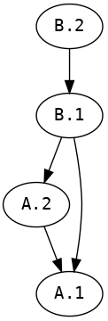

# efev - An Introduction

## Problem:

Create a web grid demo focusing on formula evaluation. Following are the aspects with which this demo is concerned.

1. Present to user with a js/react/whatever grid to input data into. Ideally, this should have dimensions of 15 x 26. We can use a smaller grid at the beginning.

2. User should be able to input strings into each cell (except row/col headers). These strings can represent numbers `(42, 3.14, ...)`, strings `("Hello", ...)` or formulas `(= 1 + 2.4, =SQRT(SUM(3,5,6)))`. These formulas can include cell references like this: `=A.2 + 23`. In the previous formula, there's a reference to the value in the cell identified by row 1 and column 'A'. Formulas can also include cell range references like this: `=SUM(A.2:A.6)`. The previous formula designates a sum of the values for cells between and including `A.2` and `A.6`. In addition to this, formulas can include operators `(+,-,*,/,%,~,...)` and custom functions `(SUM, SQRT, SIN, CONCATENATE, ...)`. (There are a host of other UI functionalities related to cell editing that we will not cover here. We are only concerned about the logic of formula evaluation.)

3. There are options on when and where to evaluate formulas:
    1. Provide an "Evaluate" button to the user. User can edit multiple cells on a "dumb" grid and when he clicks on the button, evaluation for any and all formulas in the grid can happen. This evaluation can happen on the front end itself or at the back end. For the purpose of this demo, we will consider this option only.
    2. Evaluate formulas "as they happen". When a user enters a value into a cell, the front end would immediately try to evaluate it in case it's a formula. Optionally, we can consider doing this kind of immediate evaluation at back end though it may happen to be disruptive to the user experience.

## Formula evaluation

We can think of the grid as a set of variables. A 2x2 grid having cells `A.1`, `A.2`, `B.1`, `B.2` can be represented with 4 variables having the same names. Hence, if these cells respectively contain the following values: `"2", "=A.1 + 5", "= SUM(A.1, A.2)", "= B.1"`, we can represent this grid with the following program:

#### Program-1
```
A.1 = 2;
A.2 = A.1 + 5;
B.1 = SUM(A.1, A.2);
B.2 = B.1;
```

(Let's ignore the mechanism with which we converted the cell value string in `A.1` into an integer and in `A.2` into a formula and so on for now.)

This shows that the grid can be serialized as this program and can be sent back and forth among front end and back end. Additionally, this means that if we have a way, we can evaluate this program anywhere and figure out the cell values of the grid. Basically this is an exercise in interpreting a program.

### Parsing

We use [instaparse library](https://github.com/Engelberg/instaparse) for generating a parser to parse our formula language. The parser grammar at the moment of writing this document is below:

```
"prog = assign+;
    assign = spaces cellref spaces <'='> spaces expr spaces <';'>;
    <expr> = add-sub;
    <add-sub> = mult-div | add | sub;
    add = add-sub spaces <'+'> spaces mult-div;
    sub = add-sub spaces <'-'> spaces mult-div;
    <mult-div> = factor | mult | div;
    mult = mult-div spaces <'*'> spaces factor;
    div = mult-div spaces <'/'> spaces factor;
    <factor> = funcall | number | cellref | <'('> spaces expr spaces <')'>;
    <spaces> = <#'\\s*'>;
    number = #'^[-~]?(0|[1-9]\\d*)?(\\.\\d+)?(?<=\\d)';
    cellref = colid <'.'> rowid;
    <rowid> = #'[0-9]+' | ident;
    <colid> = ident;
    <ident> = #'[a-zA-Z]\\w*';
    <funname> = ident;
    funcall = funname spaces <'('> arglist <')'> spaces;
    arglist = (spaces expr spaces <','> spaces)* expr | cellrange | Epsilon;
    cellrange = cellref <':'> cellref;"
```

If we parse [Program-1](#Program-1), we get the following parse tree:


### Evaluation

We have the parse tree and now we should be able to evaluate this tree using a tree walking algorithm. But there's some issues:

1. Cell references and cell range references mean that some cells have to be evalauated for value before others. There's an order of evaluation.
2. We need to handle self references in formulas. i.e. `A.2 = A.2 + 5;`
3. We need to handle simple or complicated circular references between cells. i.e. `A.1 = A.2 + 3; A.2 = B.1 - 5; B.1 = A.1;`

This brings us to the first necessary step:

#### Topological sorting of cells

We need to find the topological ordering of cell references so we can evaluate each cell in that order. This can be done with a topological sorting algorithm. In our example, the cell reference dependencies are as below and have to be executed in that order. i.e. `A.1, A.2, B.1, B.2`.

Topological sorting algorithms can detect cycles and self references. So, this algorithm would take care of those situations.

For this demo, we use the [dependency library](https://github.com/stuartsierra/dependency) for generating the topological sorting for cell references for a given program.



#### Evaluation

Once we have the parse tree and the cell evaluation order, evaluation has two main steps:

1. Sort the cell assign statements (`assign` in parser) which are immediate children of the top level form `prog` according to the cell evaluation order we discovered.
2. Evaluate each assign statement using a tree post-walk algorithm while keeping track of the cell value changes.

This would present us with a new state for the grid. We can serialize this state and send back to the front end which in turn will display the new state.
